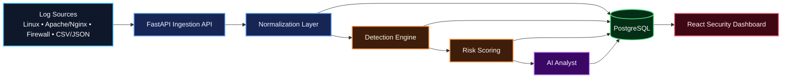
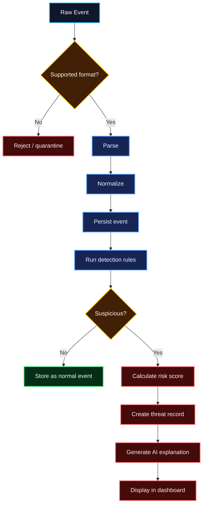

# AI Security Analyst — Project Scope & Roadmap

> **Status:** Planning / v0.1 Foundation  
> **Goal:** Build a portfolio-grade security analysis platform that ingests security logs, normalizes events, detects suspicious behavior, calculates risk, and produces analyst-friendly explanations.

## Product vision

AI Security Analyst combines deterministic security detection with AI-assisted explanation. Detection and scoring remain explainable and auditable; AI is used to summarize evidence, add context, and help an analyst investigate.

## Architecture



## MVP scope

### Log ingestion
- REST endpoint: `POST /api/v1/events`
- File upload for `.log`, `.txt`, `.csv`, `.json`
- Linux SSH/Auth
- Apache/Nginx
- Generic firewall logs
- Custom CSV/JSON

### Normalized event contract

```json
{
  "timestamp": "2026-09-21T20:32:14Z",
  "source_ip": "45.83.10.22",
  "destination_ip": "10.0.0.5",
  "source_port": 54321,
  "destination_port": 22,
  "protocol": "TCP",
  "event_type": "authentication_failure",
  "username": "admin",
  "source": "linux_ssh"
}
```

### Detection engine
- Brute-force / credential guessing
- Port scanning
- Known flagged source
- Request bursts / possible DoS
- Successful login after repeated failures

### Risk scoring

| Score | Severity |
|---:|---|
| 0–29 | Low |
| 30–59 | Medium |
| 60–79 | High |
| 80–100 | Critical |

AI must never be the sole source of severity.

## Detection pipeline



## Technical stack

- Python 3.12+
- FastAPI
- Pydantic
- SQLAlchemy
- Alembic
- PostgreSQL
- React
- TypeScript
- Vite
- Tailwind CSS
- Docker / Docker Compose
- Pytest
- GitHub Actions

## Delivery roadmap

### v0.1 — Foundation
FastAPI, PostgreSQL, Alembic, Docker, health endpoint, event ingestion, event model, tests, CI.

### v0.2 — Detection
Parsers, normalization, deterministic detection framework, risk scoring, threat records.

### v0.3 — AI Analyst
Provider abstraction, evidence-aware summaries, prompt-injection defenses, validation and fallback.

### v0.4 — Threat Intelligence
MITRE ATT&CK mappings, IP reputation abstraction, timelines, search/filtering, human-approved banned-IP integration design.

### v0.5 — Advanced Analytics
Historical aggregation, baselines, anomaly scoring, correlation, tuning and load testing.

### v0.9 — Hardening
Threat model, auth, upload/rate controls, security scanning, audit logging, release candidate QA.

### v1.0 — Portfolio Release
Polished documentation, demo data, UI, release automation, coverage gate and portfolio narrative.

## Engineering principles

- Explainable detections before opaque ML.
- Human review before automated blocking.
- No secrets or production credentials.
- Sanitized/synthetic sample logs only.
- Security rules must be unit-testable.
- Raw logs and normalized events remain distinguishable.
- AI output never silently overwrites deterministic evidence.
- Architecture diagrams must use **Mermaid code with explicit styling/colors**.
