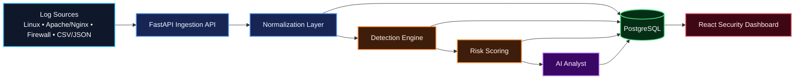

# AI Security Analyst

A portfolio-grade security analysis platform that ingests logs, normalizes events, detects suspicious behavior, calculates explainable risk, and generates analyst-friendly AI summaries.

> **Status:** v0.1 Foundation  
> **License:** MIT

## Why this project exists

Security teams often work across heterogeneous logs and noisy event streams. This project is designed to turn raw telemetry into a traceable investigation workflow where deterministic evidence remains authoritative and AI helps explain—not invent—the result.

## Architecture

## Core capabilities

- REST and file-based log ingestion
- Canonical security-event normalization
- Deterministic detection rules
- Explainable 0–100 risk scoring
- Threat persistence and evidence timelines
- AI-assisted summaries with validation and fallback behavior
- MITRE ATT&CK mappings
- Optional threat-intelligence enrichment
- Historical analytics, anomaly scoring, and cross-event correlation
- Human approval before any future blocking/enforcement action

## Technology

**Backend:** Python 3.12+, FastAPI, Pydantic, SQLAlchemy, Alembic  
**Database:** PostgreSQL  
**Frontend:** React, TypeScript, Vite, Tailwind CSS  
**Infrastructure:** Docker, Docker Compose, GitHub Actions  
**Testing:** Pytest + integration tests

## Roadmap

| Version | Focus |
|---|---|
| v0.1 | Foundation & Core Ingestion |
| v0.2 | Parsing, Detection & Risk Scoring |
| v0.3 | AI Analyst |
| v0.4 | Threat Intelligence & MITRE ATT&CK |
| v0.5 | Analytics, Correlation & Anomaly Detection |
| v0.9 | Security Hardening & Release Candidate |
| v1.0 | Portfolio Release |

See [AI_SECURITY_ANALYST_PLAN.md](AI_SECURITY_ANALYST_PLAN.md) for the full product scope and [docs/GITHUB_PROJECT_STRUCTURE.md](docs/GITHUB_PROJECT_STRUCTURE.md) for the GitHub operating model.

## Engineering principles

- Explainable detection before opaque automation.
- AI never silently replaces deterministic evidence.
- Raw and normalized data remain distinguishable.
- Sample logs must be synthetic or sanitized.
- Secrets and production credentials must never be committed.
- Detection logic must be unit-testable.
- Architecture and process diagrams are stored as **Mermaid source with explicit styling/colors**.
- Blocking/enforcement actions require human review.

## Development workflow

1. Start from an issue with acceptance criteria.
2. Use a short-lived branch such as `feature/<issue>-name`.
3. Add tests for behavior changes.
4. Open a pull request linked to the issue.
5. Pass CI and security checks.
6. Merge into `main`.

See [CONTRIBUTING.md](CONTRIBUTING.md).

## Security

This project processes untrusted telemetry and future AI-generated analysis. Review [SECURITY.md](SECURITY.md) before contributing security-sensitive changes.

## License

MIT License. See [LICENSE](LICENSE).
