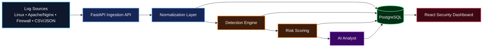

# AI Security Analyst

A portfolio-grade security analysis platform that ingests logs, normalizes events, detects suspicious behavior, calculates explainable risk, and generates analyst-friendly AI summaries.

> **Status:** v0.9 Release Candidate  
> **License:** MIT

## Why this project exists

Security teams often work across heterogeneous logs and noisy event streams. This project is designed to turn raw telemetry into a traceable investigation workflow where deterministic evidence remains authoritative and AI helps explain—not invent—the result.

## Architecture



## Core capabilities

- REST and file-based log ingestion
- Canonical security-event normalization
- Deterministic detection rules
- Explainable 0–100 risk scoring
- Threat persistence and evidence timelines
- AI-assisted summaries with validation and fallback behavior
- MITRE ATT&CK mappings
- Optional threat-intelligence enrichment
- Historical analytics, anomaly scoring, and cross-event correlation
- Human approval before any future blocking/enforcement action

## Technology

**Backend:** Python 3.12+, FastAPI, Pydantic, SQLAlchemy, Alembic  
**Database:** PostgreSQL  
**Frontend:** React, TypeScript, Vite, Tailwind CSS  
**Infrastructure:** Docker, Docker Compose, GitHub Actions  
**Testing:** Pytest + integration tests

## Roadmap

| Version | Focus |
|---|---|
| v0.1 | Foundation & Core Ingestion |
| v0.2 | Parsing, Detection & Risk Scoring |
| v0.3 | AI Analyst |
| v0.4 | Threat Intelligence & MITRE ATT&CK |
| v0.5 | Analytics, Correlation & Anomaly Detection |
| v0.9 | Security Hardening & Release Candidate |
| v1.0 | Portfolio Release |

See [AI_SECURITY_ANALYST_PLAN.md](AI_SECURITY_ANALYST_PLAN.md) for the full product scope and [docs/GITHUB_PROJECT_STRUCTURE.md](docs/GITHUB_PROJECT_STRUCTURE.md) for the GitHub operating model.

## Engineering principles

- Explainable detection before opaque automation.
- AI never silently replaces deterministic evidence.
- Raw and normalized data remain distinguishable.
- Sample logs must be synthetic or sanitized.
- Secrets and production credentials must never be committed.
- Detection logic must be unit-testable.
- Architecture and process diagrams are stored as **Mermaid source with explicit styling/colors**.
- Blocking/enforcement actions require human review.

## Functional dashboard

The development container now starts the complete local stack automatically:

- PostgreSQL 17
- FastAPI backend on `http://localhost:8000`
- React/Vite dashboard on `http://localhost:5173`

After **Dev Containers: Rebuild Container Without Cache**, VS Code should open the dashboard port automatically.

### Fast demo

1. Open `http://localhost:5173`.
2. Click **Load demo + analyze**.
3. The UI ingests synthetic brute-force and port-scan events.
4. The backend runs deterministic analysis.
5. Open **Threats** to inspect risk scores and MITRE ATT&CK mappings.
6. Click a threat to inspect its evidence timeline.

The demo uses synthetic documentation ranges (`203.0.113.0/24` and `198.51.100.0/24`) and does not contain production telemetry.

## Open in Visual Studio Code Dev Container

This repository includes a ready-to-use VS Code Dev Container with Python 3.12 and PostgreSQL 17.

### Requirements

- Docker Desktop (or a compatible Docker Engine)
- Visual Studio Code
- The **Dev Containers** extension

### Open the project

1. Clone the repository and open it in VS Code.
2. Open the Command Palette with `F1` / `Cmd+Shift+P`.
3. Run **Dev Containers: Reopen in Container**.
4. Let VS Code build the development image and start PostgreSQL.
5. The container automatically runs Alembic migrations.

Once connected, the repository is mounted at:

```text
/workspace
```

### Run the API

Use **Run and Debug → FastAPI: Dev Server**, press `F5`, or run:

```bash
cd /workspace/backend
uvicorn app.main:app --host 0.0.0.0 --port 8000 --reload
```

Then open:

```text
http://localhost:8000/health
```

### Useful VS Code tasks

Open **Terminal → Run Task** and choose:

- `Backend: Run tests`
- `Backend: Ruff`
- `Database: Upgrade`
- `Backend: Run API`

If `.devcontainer/` changes, run **Dev Containers: Rebuild Container**.

## Quick start

### Requirements

- Docker + Docker Compose, or Python 3.12+ and PostgreSQL 17+
- Git

### Docker setup

```bash
cp .env.example .env
```

Change the placeholder database password in `.env`, then start the full stack:

```bash
docker compose up --build
```

Open the functional dashboard at:

```text
http://localhost:8080
```

The FastAPI service remains available at `http://localhost:8000`.

Health check:

```bash
curl http://localhost:8000/health
```

Expected response:

```json
{"status":"healthy"}
```

Submit the synthetic sample event:

```bash
curl -X POST http://localhost:8000/api/v1/events \
  -H "Content-Type: application/json" \
  --data @samples/events/auth_failure.json
```

Expected response shape:

```json
{
  "id": 1,
  "status": "accepted",
  "normalized": true
}
```

### Backend development

```bash
cd backend
python -m venv .venv
source .venv/bin/activate
python -m pip install -e ".[dev]"
alembic upgrade head
uvicorn app.main:app --reload
```

Run tests and linting:

```bash
pytest --cov=app --cov-report=term-missing
ruff check .
```

## Development workflow

All project changes are currently written directly to `main` by project decision.

See [CONTRIBUTING.md](CONTRIBUTING.md).

## Security

This project processes untrusted telemetry and future AI-generated analysis. Review [SECURITY.md](SECURITY.md) before contributing security-sensitive changes.

## License

MIT License. See [LICENSE](LICENSE).
