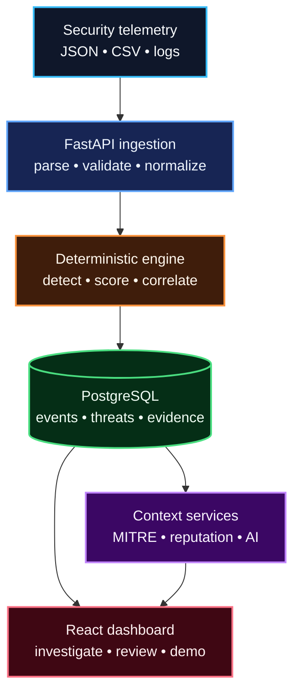

# AI Security Analyst

AI Security Analyst is a portfolio-grade security operations platform that turns
raw telemetry into explainable, reviewable investigations. It ingests heterogeneous
logs, normalizes them into one event contract, applies deterministic detection and
risk scoring, and uses AI only to explain evidence—not to invent or replace it.

> **Status:** v1.0.0 stable release  
> **Validated baseline:** 73+ tests, at least 85% backend line coverage  
> **License:** MIT

## Why it matters

Security analysts often move between inconsistent logs, noisy alerts, and tools
that cannot explain why something is risky. This project demonstrates an auditable
alternative:

- preserve raw context while normalizing fields;
- detect behavior with testable rules;
- calculate risk from explicit evidence;
- map findings to MITRE ATT&CK;
- keep AI output bounded, validated, and optional;
- require human judgment before any enforcement action.

## What the product does

- Ingests canonical JSON, CSV, SSH/auth, Apache/Nginx, and firewall records
- Detects brute-force behavior, successful login after failures, port scans, and
  high-rate web requests
- Assigns explainable 0–100 risk scores and severity bands
- Persists threat evidence, timelines, reviews, analytics snapshots, and cases
- Adds MITRE ATT&CK mappings and optional IP-reputation context
- Generates validated analyst summaries with deterministic fallback behavior
- Correlates related threats and calculates historical anomaly scores
- Presents events, threats, evidence, and a guided synthetic demo in a React dashboard
- Protects the API with optional role-based keys, size limits, rate limits, trusted
  hosts, CORS controls, security headers, and request IDs

## Architecture



The deterministic path remains authoritative. Provider failures degrade to explicit
fallback/unavailable states and do not alter stored evidence or risk scores.

Read [the architecture guide](docs/ARCHITECTURE.md) for components, trust
boundaries, persistence, failure behavior, and design decisions.

## Guided demo

The repository includes 21 synthetic events using RFC 5737 documentation ranges:
three normal events, six authentication failures, and twelve firewall probes.

```bash
cp .env.example .env
# Replace POSTGRES_PASSWORD=change_me
docker compose up --build -d
python scripts/seed_demo.py
```

Open [http://localhost:8080](http://localhost:8080), run the guided investigation,
then inspect the two expected findings:

- `auth.brute_force`
- `network.port_scan`

No private telemetry or external AI service is required. See
[the demo walkthrough](docs/DEMO.md).

## Technology

| Layer | Technologies |
|---|---|
| Backend | Python 3.12, FastAPI, Pydantic, SQLAlchemy, Alembic |
| Database | PostgreSQL 17 |
| Frontend | React 18, TypeScript, Vite, custom responsive CSS |
| Runtime | Docker, Docker Compose, Nginx, Uvicorn |
| Quality | Pytest, pytest-cov, Ruff, mypy |
| Security CI | pip-audit, Bandit, Trivy |
| Delivery | GitHub Actions, VS Code Dev Containers |

## Repository structure

```text
backend/
  app/
    api/routes/       HTTP endpoints
    ingestion/        batch handling and parsers
    detection/        deterministic rules and risk scoring
    services/         analysis, reputation, analytics, correlation
    ai/               provider abstraction and prompt contracts
    security/         authentication and roles
    middleware/       request and response protections
    models/           SQLAlchemy persistence models
    schemas/          Pydantic API contracts
  alembic/            database migrations
  tests/              unit and integration tests
frontend/
  src/                React dashboard, API client, and guided demo
samples/
  demo/               canonical synthetic dataset
scripts/
  seed_demo.py        reproducible ingest-and-verify command
docs/                 architecture, API, operations, security, and demo guides
.github/workflows/     backend, frontend, and dev-container CI
```

## Quick start

Requirements: Git and Docker with the Compose plugin.

```bash
git clone https://github.com/alianisreyesr/ai-security-analyst.git
cd ai-security-analyst
cp .env.example .env
docker compose up --build
```

After changing the example database password:

- Dashboard: [http://localhost:8080](http://localhost:8080)
- API health: [http://localhost:8000/health](http://localhost:8000/health)
- OpenAPI in development: [http://localhost:8000/docs](http://localhost:8000/docs)

For a VS Code workflow, reopen the repository in its Dev Container. It starts
PostgreSQL, the API, and the Vite dashboard and applies migrations automatically.

## Quality and security posture

The stable-release gate requires:

- backend tests with at least 85% line coverage;
- Ruff and mypy;
- PostgreSQL migration validation;
- dependency auditing and static security analysis;
- filesystem and container vulnerability scans;
- frontend TypeScript and production-container builds;
- full-stack Dev Container verification.

Important design decisions:

- Detection and severity never depend solely on AI.
- Threat fingerprints make repeat analysis idempotent for the same evidence.
- Raw telemetry and normalized fields remain distinguishable.
- Provider output is schema-validated and prompt-injection defenses are tested.
- Production startup requires authentication.
- Automated IP blocking is intentionally outside the current product boundary.
- Samples and screenshots may contain synthetic data only.

See [the threat model](docs/THREAT_MODEL.md),
[security hardening](docs/SECURITY_HARDENING.md), and
[release quality gate](docs/RELEASE_QUALITY_GATE.md).

## Documentation

- [Architecture and design decisions](docs/ARCHITECTURE.md)
- [API reference](docs/API_REFERENCE.md)
- [Configuration reference](docs/CONFIGURATION.md)
- [Setup, deployment, persistence, backup, and restore](docs/DEPLOYMENT.md)
- [Synthetic demo and reviewer walkthrough](docs/DEMO.md)
- [Detection rules](docs/detection-rules.md)
- [Analytics and correlation](docs/analytics-correlation.md)
- [Threat intelligence](docs/threat-intelligence.md)
- [Product UI accessibility review](docs/UI_ACCESSIBILITY.md)
- [Release process](docs/RELEASING.md)
- [v1.0.0 release notes](docs/releases/v1.0.0.md)
- [Portfolio and resume narrative](PORTFOLIO.md)
- [Contribution workflow](CONTRIBUTING.md)

## Roadmap status

| Version | Outcome | Status |
|---|---|---|
| v0.1 | Foundation and ingestion | Complete |
| v0.2 | Parsing, detection, and risk scoring | Complete |
| v0.3 | Evidence-aware AI analyst | Complete |
| v0.4 | Threat intelligence and MITRE ATT&CK | Complete |
| v0.5 | Analytics, anomaly detection, and correlation | Complete |
| v0.9 | Security hardening and release candidate | Complete |
| v1.0 | Portfolio packaging and stable release | Complete |

v1.0.0 completes the documented release gate, synthetic demo, product UI,
release automation, changelog, and portfolio narrative.

See [AI_SECURITY_ANALYST_PLAN.md](AI_SECURITY_ANALYST_PLAN.md) and the
[v1.0 milestone](https://github.com/alianisreyesr/ai-security-analyst/issues/8).

## License

MIT License. See [LICENSE](LICENSE).
