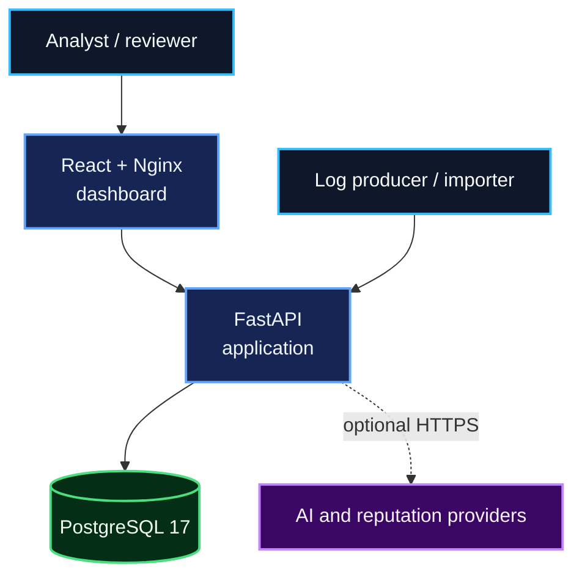
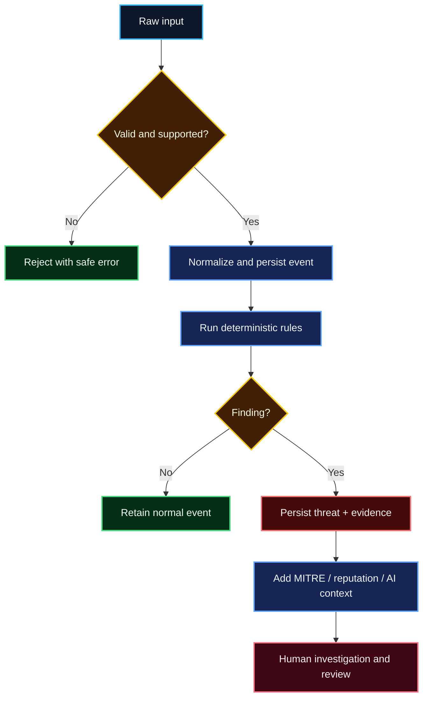
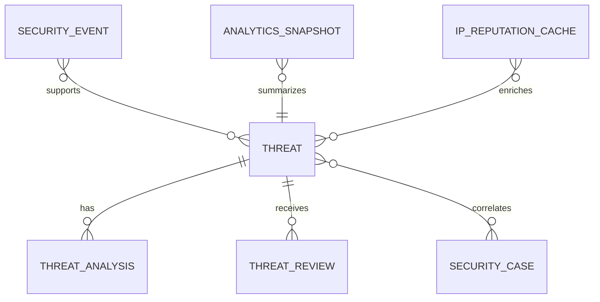

# Architecture and design decisions

## System goals

AI Security Analyst is designed to make a security finding traceable from raw input
to analyst decision. Its architecture prioritizes explainability, deterministic
behavior, safe degradation, and local reproducibility.

It is not an autonomous response platform. It does not block an address, disable an
account, or claim that a detection proves compromise.

## Runtime context

The Compose deployment keeps PostgreSQL on the internal application network. Host
ports expose the dashboard and API for local evaluation. A public deployment
should place TLS, request logging, and perimeter controls in front of the services.

## Investigation flow

## Component responsibilities

| Component | Responsibility | Does not do |
|---|---|---|
| API routes | Validate HTTP input, enforce roles, shape responses | Implement detection logic |
| Ingestion | Parse supported formats and create canonical events | Infer malicious intent |
| Detection | Evaluate explicit windows/thresholds and emit evidence | Call AI providers |
| Risk scoring | Convert deterministic findings to bounded severity | Accept provider overrides |
| Threat service | Persist idempotent findings and evidence IDs | Delete original events |
| AI analyst | Produce schema-validated explanations or fallback | Create evidence or severity |
| Reputation | Add cached source-IP context | Block the source |
| Analytics | Build time buckets and anomaly baselines | Rewrite historical events |
| Correlation | Group related persisted threats into cases | Merge unrelated evidence |
| Dashboard | Present data and initiate approved API workflows | Store authoritative state |

## Persistence model

PostgreSQL is the system of record. Threats store supporting event IDs and a
fingerprint derived from the rule, source, time range, and evidence IDs. Re-running
analysis over identical evidence returns the existing threat rather than silently
duplicating it.

## Trust boundaries

1. **Untrusted telemetry → ingestion.** Request and batch sizes are bounded; schema
   validation forbids unknown canonical fields; parser errors do not echo raw input.
2. **Browser → API.** Optional API keys establish analyst/admin roles. Production
   cannot start with authentication disabled. CORS and trusted-host settings are
   explicit allowlists.
3. **API → external providers.** AI and reputation calls are optional, bounded by
   timeouts, and isolated behind provider abstractions. Unavailable providers return
   explicit states.
4. **Provider text → analyst output.** Evidence is supplied separately, prompt
   injection patterns are handled, output is schema-validated, and deterministic
   fallback remains available.
5. **Application → database.** Alembic owns schema evolution; a named volume or
   managed database owns durability.

## Key decisions

| Decision | Rationale | Tradeoff |
|---|---|---|
| Deterministic rules before ML | Findings remain explainable and unit-testable | Rules require explicit tuning |
| AI as context, never authority | Provider failure cannot change severity or evidence | AI cannot autonomously resolve incidents |
| Preserve repeated raw events | Identical-looking records may be distinct observations | Event-level deduplication is source-specific future work |
| Fingerprint threats | Repeat analysis is idempotent for identical evidence | New event IDs legitimately create new findings |
| Human review before enforcement | Reduces unsafe automated blocking | Response actions remain manual/integrated later |
| Local provider-disabled mode | Demo and tests require no private service | External enrichment is not shown by default |
| PostgreSQL system of record | Relational evidence and migrations are auditable | Requires backup and operational ownership |
| One API process rate limiter | Simple local protection | Multi-replica production needs a gateway/shared limiter |

## Failure behavior

- Invalid input: rejected with bounded, non-echoing errors.
- Database unavailable: health/dependent requests fail; Compose waits for DB health.
- AI unavailable or invalid: deterministic fallback analysis is stored.
- Reputation unavailable: an explicit unavailable/unsupported response is returned.
- Repeated analysis: existing threat fingerprint is reused.
- Empty database: dashboard shows guided empty states.
- API unavailable: dashboard shows an error and retry control.
- Security scan or coverage regression: release-readiness fails.

## Deployment and operations

The reference topology is a single-host Compose stack. Containers are disposable;
PostgreSQL data is durable in `postgres_data`. Logical backup and restore commands,
production controls, and clean-checkout verification are documented in
[DEPLOYMENT.md](DEPLOYMENT.md).

## Related documents

- [API reference](API_REFERENCE.md)
- [Configuration](CONFIGURATION.md)
- [Threat model](THREAT_MODEL.md)
- [Detection rules](detection-rules.md)
- [AI analyst](ai-analyst.md)
- [Release quality gate](RELEASE_QUALITY_GATE.md)
