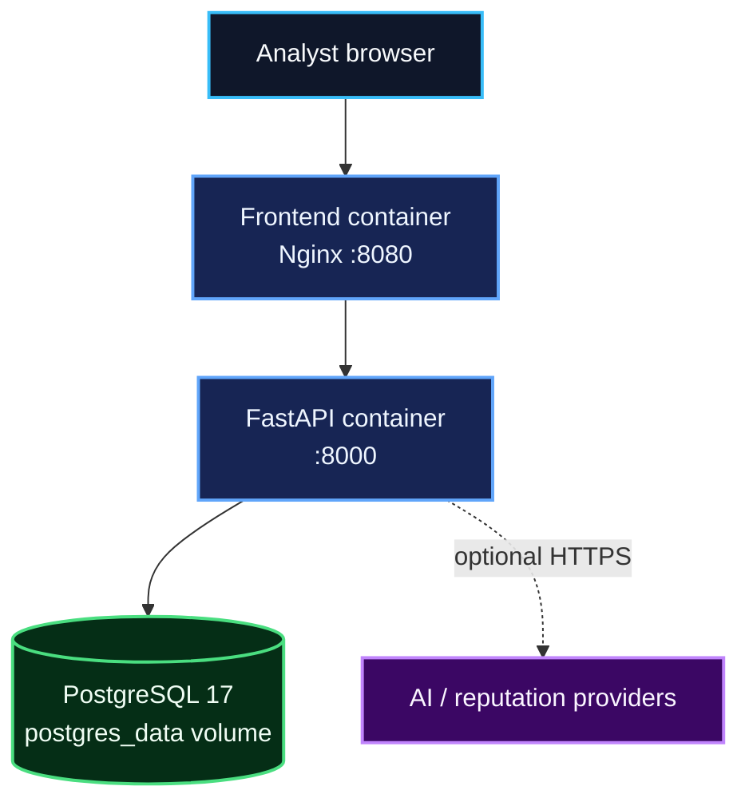

# Setup, deployment, and data operations

## Clean checkout

Requirements: Git and Docker with the Compose plugin.

```bash
git clone https://github.com/alianisreyesr/ai-security-analyst.git
cd ai-security-analyst
cp .env.example .env
```

Replace `POSTGRES_PASSWORD=change_me`. For an internet-facing or shared
environment, also set `APP_ENV=production`, enable authentication, provide both
API keys, and configure allowed hosts/origins.

Start the complete stack:

```bash
docker compose up --build -d
docker compose ps
curl --fail http://localhost:8000/health
```

Open the dashboard at `http://localhost:8080`. Run the verified demo with:

```bash
python scripts/seed_demo.py
```

Stop containers without deleting data:

```bash
docker compose down
```

## Deployment architecture



Compose creates the named `postgres_data` volume. The API waits for PostgreSQL,
runs `alembic upgrade head`, and then starts Uvicorn. The frontend waits for the
API health check and proxies API requests to the internal API service.

The supplied Compose file is a reproducible single-host deployment, not a complete
public-cloud perimeter. Put TLS and request logging at a trusted reverse proxy,
restrict port exposure, inject secrets through the platform, and use managed
PostgreSQL or encrypted storage when appropriate.

## Production checklist

- Set `APP_ENV=production` and `AUTH_ENABLED=true`.
- Generate distinct high-entropy analyst and administrator keys.
- Set `ALLOWED_HOSTS` and the exact `CORS_ALLOWED_ORIGINS`.
- Enable rate limiting; use a shared/gateway limiter when running multiple API replicas.
- Keep API docs disabled unless operationally required.
- Terminate TLS before the frontend/API.
- Restrict database access to the application network.
- Configure centralized logs and external health monitoring.
- Establish backup retention and test restores.
- Run the release-quality workflows against the exact deployed commit.

## Persistence

All primary application records live in PostgreSQL. The named Docker volume
`postgres_data` survives `docker compose down`, container replacement, and image
rebuilds. It is deleted by `docker compose down -v`; do not use `-v` unless data
removal is intentional and a verified backup exists.

The application container filesystem is disposable and must not be treated as
persistent storage.

## Backup

Create a compressed logical backup without stopping the stack:

```bash
mkdir -p backups
docker compose exec -T db sh -c \
  'pg_dump -U "$POSTGRES_USER" -d "$POSTGRES_DB" -Fc' \
  > "backups/security-analyst-$(date +%Y%m%d-%H%M%S).dump"
```

Store backups outside the Docker host, encrypt them, apply retention, and monitor
backup completion. A file that has never been restored is not a verified backup.

## Restore

Restoration overwrites database objects. Take a current backup and stop API writes
before continuing.

```bash
docker compose stop api
docker compose exec -T db sh -c \
  'pg_restore --clean --if-exists -U "$POSTGRES_USER" -d "$POSTGRES_DB"' \
  < backups/security-analyst-YYYYMMDD-HHMMSS.dump
docker compose start api
curl --fail http://localhost:8000/health
```

After restoring, verify event/threat counts and run the demo or an approved smoke
test. Never restore untrusted database dumps.

## Clean-checkout verification

GitHub Actions checks out the repository into a fresh runner and validates:

- Docker Compose configuration
- Development service builds
- PostgreSQL readiness and Alembic migrations
- API and dashboard health
- Backend tests, linting, typing, and coverage
- Frontend production build
- Dependency, static-analysis, filesystem, and container security scans

See [RELEASE_QUALITY_GATE.md](RELEASE_QUALITY_GATE.md) for the release decision.
