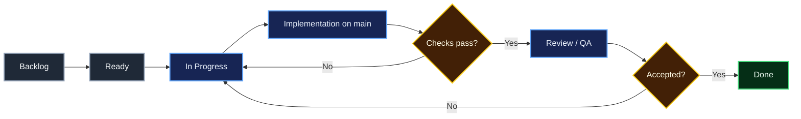

# AI Security Analyst — GitHub Project Structure

## Version roadmap

1. v0.1 — Foundation & Core Ingestion
2. v0.2 — Parsing, Detection & Risk Scoring
3. v0.3 — AI Analyst
4. v0.4 — Threat Intelligence & MITRE ATT&CK
5. v0.5 — Analytics, Correlation & Anomaly Detection
6. v0.9 — Security Hardening & Release Candidate
7. v1.0 — Portfolio Release

## Recommended GitHub Project

Name: **AI Security Analyst — Roadmap**

Fields:
- Status: Backlog / Ready / In Progress / In Review / Blocked / Done
- Priority: P0 / P1 / P2 / P3
- Version: v0.1 / v0.2 / v0.3 / v0.4 / v0.5 / v0.9 / v1.0
- Area: Backend / Frontend / Detection / AI / Data / Security / DevOps / Docs
- Size: XS / S / M / L / XL
- Type: Feature / Bug / Chore / Research / Security / Documentation / Test
- Risk: Low / Medium / High

Views:
- Roadmap by Version
- Board by Status
- Current Milestone
- Security Work
- Bugs
- Documentation
- Release Readiness

## Issue lifecycle

## Main-only workflow

By project decision, changes are currently committed directly to `main`. No additional development branches should be created unless this policy is explicitly changed later.

## Definition of Ready
- Problem/outcome is clear.
- Acceptance criteria exist.
- Dependencies are identified.
- Security implications are considered.

## Definition of Done
- Acceptance criteria are satisfied.
- Relevant tests pass.
- Documentation is updated.
- No secrets or unsafe sample data were introduced.
- CI passes.
