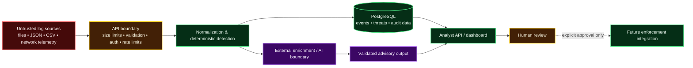

# Application Threat Model

## Scope

AI Security Analyst ingests attacker-influenced telemetry, stores normalized security evidence, runs deterministic detections and analytics, optionally enriches data with external providers, and can generate AI-assisted explanations.

## Trust boundaries

## Assets

- Security events and their original evidence
- Threat records, scores, detections and analyst review state
- API credentials and external-provider credentials
- Audit trail and correlation/analytics state
- Availability and integrity of the ingestion pipeline

## Primary abuse cases and mitigations

| Abuse case | Risk | Current mitigation |
|---|---|---|
| Oversized or high-rate ingestion | Resource exhaustion | Request-size middleware, batch row/content limits, configurable rate limiting |
| Malformed attacker-controlled logs | Parser crashes or unsafe state | Pydantic validation, bounded parsers, structured failures, tests |
| Unauthorized API use | Evidence disclosure or mutation | API-key authentication and analyst/admin roles; production refuses disabled auth |
| Credential leakage | Provider/database compromise | Environment-only secrets, placeholder environment example, redaction-aware logging policy |
| Prompt injection in log content | AI follows attacker text | Logs treated as untrusted evidence, delimited prompt construction, output validation |
| Hallucinated AI claims | Misleading investigation | Deterministic evidence remains authoritative; AI output is advisory and validated |
| Malicious/failed enrichment provider | Pipeline disruption or false context | Provider abstraction, timeouts, caching, graceful failure |
| Autonomous blocking | Availability/abuse risk | Enforcement is design-only and requires explicit human approval |
| Host/CORS misuse | Browser/API exposure | Optional trusted-host allowlist, explicit CORS origins, restrictive allowed methods/headers |
| Production debug/docs exposure | Information disclosure | API docs disabled by default in production unless explicitly enabled |

## Security invariants

1. Production must not start with authentication disabled.
2. Analyst endpoints require an authenticated analyst or admin when authentication is enabled.
3. Administrative/rebuild operations require the admin role.
4. AI and reputation-provider failures must not delete or replace deterministic evidence.
5. No future blocking action may occur without an explicit human approval state.
6. Sample and test data must remain synthetic or sanitized.

## Residual risks

The current API-key model is intentionally a foundation rather than a full identity platform. Keys are static credentials and should be rotated and injected through a deployment secret manager. Distributed rate limiting is not yet implemented; the current limiter is process-local. Production deployment also needs TLS termination, database access controls, backups, monitoring and network policy supplied by the hosting environment.
