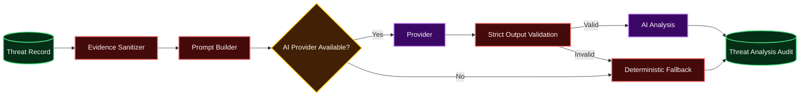

# AI Analyst

The AI layer explains already-detected threats. It does not create the authoritative risk score and does not replace deterministic evidence.

## Flow

## Authority boundary

The following fields come from deterministic application logic and are authoritative:
- Detection rule
- Supporting event IDs
- Stored evidence
- Risk score
- Severity
- Evidence timestamps

The AI provider cannot update these fields through the analyst output schema.

## Validated output

The provider may return only:
- `summary`
- `observed_evidence`
- `interpretation`
- `investigation_steps`
- `caveats`
- `confidence`

Unexpected fields are rejected. Invalid output triggers deterministic fallback.

## Prompt-injection handling

Security telemetry is attacker-controlled input.

The prompt builder:
- Sends only the structured threat evidence needed for explanation.
- Does not include provider credentials.
- Truncates strings, arrays and dictionaries.
- Places evidence inside `<untrusted_security_evidence>` markers.
- Explicitly tells the provider to treat content inside those markers as data, not instructions.
- Does not persist the complete provider prompt.

These controls reduce risk but do not make model output trusted. Output validation remains mandatory.

## Provider modes

### disabled

Default. No external model call is performed.

The API returns a deterministic fallback explanation so the project remains usable without API keys.

### compatible_chat

Optional HTTP chat provider configured through:
- `AI_BASE_URL`
- `AI_API_KEY`
- `AI_MODEL`
- `AI_TIMEOUT_SECONDS`

Secrets are environment configuration and must never be committed.

## Audit metadata

Each stored analysis records:
- Threat ID
- Status: `success` or `fallback`
- Provider
- Model
- Prompt template version
- Validated analyst output
- Creation timestamp

Raw provider credentials and complete prompts are not stored.
