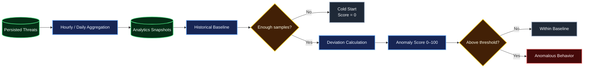
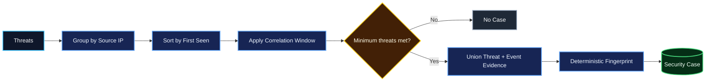
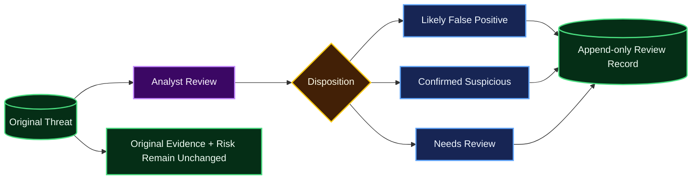

# Analytics, Correlation and Anomaly Detection

v0.5 adds historical context without replacing deterministic detection.

## Analytics flow



## Metric used for the initial baseline

The first baseline signal is **threat count per source IP per analytics bucket**.

Supported bucket sizes:
- `hour`
- `day`

Snapshots retain:
- total threat count;
- severity counts;
- rule counts;
- source-IP counts.

Rebuilds are bounded by `ANALYTICS_MAX_DAYS` and intentionally create empty buckets. This makes gaps explicit instead of silently removing zero-activity periods.

## Cold start

A baseline is not considered ready until at least `BASELINE_MIN_SAMPLES` historical values are available.

During cold start:
- anomaly score is `0`;
- `anomalous=false`;
- the API explains that more history is required.

This avoids treating lack of history as suspicious behavior.

## Anomaly score

The anomaly score is separate from deterministic threat risk.

When the baseline is ready:

1. Calculate the historical mean and population standard deviation.
2. Measure positive deviation from the mean using a z-score.
3. Convert positive deviation to a 0–100 score using `round(z_score * 20)`.
4. Clamp the result to 100.
5. Compare against `ANOMALY_SCORE_THRESHOLD`.

When standard deviation is zero and the current value rises above the historical mean, the implementation uses a conservative z-score of `3.0` so the change remains visible.

The score is interpretable context; it does not overwrite a threat's deterministic `risk_score`.

## Correlation



Correlation:
- handles out-of-order threat input by sorting timestamps;
- uses a configurable time window;
- requires a configurable minimum threat count;
- preserves supporting threat IDs and event IDs;
- records distinct rule IDs as evidence;
- uses a SHA-256 fingerprint so re-running the same correlation is idempotent.

A correlated case is investigation context. It does not rewrite the original threat records.

## False-positive review



Review feedback is stored separately in `threat_reviews`. It never silently edits:
- original evidence;
- deterministic risk score;
- detection rule.

Rule threshold changes remain explicit configuration/code changes that must be tested.

## Performance validation

A lightweight CI smoke test exercises the detection engine with 1,000 synthetic events.

For repeatable local measurements:

```bash
cd backend
python benchmarks/analysis_benchmark.py
```

The benchmark prints JSON containing:
- event count;
- duration in seconds;
- events per second;
- number of findings.

It intentionally does not enforce a brittle wall-clock threshold in CI because shared runners vary. The output can be captured between releases to identify regressions and bottlenecks.

## API endpoints

- `POST /api/v1/analytics/rebuild`
- `GET /api/v1/analytics/sources/{source_ip}/anomaly`
- `POST /api/v1/correlation/run`
- `POST /api/v1/threats/{threat_id}/reviews`
- `GET /api/v1/threats/{threat_id}/reviews`
