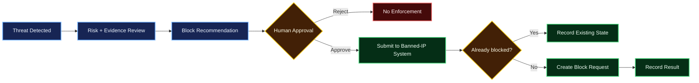

# Human-Approved Banned-IP Integration Design

This integration is intentionally **recommendation-only** from AI Security Analyst. Detection or AI output must never directly block an address.

## Proposed workflow

## Approval states

A future integration record should use explicit states:
- `recommended`
- `approved`
- `rejected`
- `submitted`
- `already_blocked`
- `failed`
- `reverted`

Only a human actor may transition `recommended → approved`.

## Duplicate/IP-state handling

Before submission:
1. Validate the IP format.
2. Reject non-global addresses unless the target system explicitly supports an internal scope.
3. Check whether the IP already exists in the destination banned list.
4. Check whether it is still present as a pending/potential threat.
5. Use an idempotency key derived from threat ID + IP + requested action.

Duplicate submissions should return `already_blocked` or the existing request rather than create another row.

## Failure behavior

If the destination system is unavailable:
- Keep the local recommendation and approval record.
- Mark submission as `failed`.
- Do not claim the IP was blocked.
- Allow an explicit retry after review.

## Rollback / unblock

A future unblock action must be separate from detection logic and require human approval. The audit record should preserve who approved the action, when it was sent and the destination response.

## Data contract

Minimum submission fields:
- Threat ID
- Source IP
- Deterministic rule ID
- Risk score
- Human approver identity
- Approval timestamp
- Idempotency key
- Optional analyst comment

AI-generated prose may be included as context, but it must not be the authoritative reason for enforcement.
