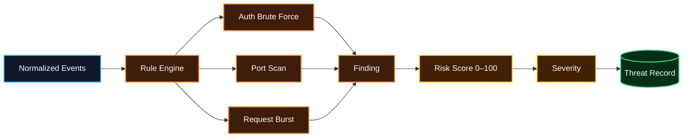

# Detection Rules

AI Security Analyst v0.2 uses deterministic, explainable rules. AI is not involved in rule execution or risk-score calculation.

## Detection flow

## Severity bands

| Score | Severity |
|---:|---|
| 0–29 | Low |
| 30–59 | Medium |
| 60–79 | High |
| 80–100 | Critical |

Scores are clamped to the 0–100 range.

## auth.brute_force

**Objective:** identify repeated authentication failures from one source IP.

Initial rule:
- At least 5 authentication failures
- Same source IP
- Best matching 5-minute window
- Score starts at 30
- +5 points per failed attempt in the detected window
- +2 points per unique username
- Score capped at 85 before follow-up correlation

Evidence stored:
- Failed attempt count
- Unique username count
- Up to 20 targeted usernames
- Event IDs
- Time window

## auth.brute_force_success

**Objective:** identify a successful authentication shortly after a brute-force cluster.

Correlation:
- A brute-force finding already exists
- Same source IP
- Authentication success occurs within 5 minutes after the failure cluster
- +15 risk points
- Final score capped at 100

This does **not** prove account compromise. It marks a sequence that warrants investigation.

## network.port_scan

**Objective:** identify probing across many destination ports.

Initial rule:
- Firewall-origin events
- Same source IP
- At least 10 unique destination ports
- Best matching 5-minute window
- Base score: 60
- +2 for each unique port above 10
- Score capped at 90

## web.request_burst

**Objective:** identify unusually high request volume from one source.

Initial rule:
- Normalized `http_request` events
- Same source IP
- At least 50 requests
- Best matching 1-minute window
- Base score: 50
- +1 for each request above 50
- Score capped at 85

This rule identifies rate behavior only; it does not independently establish malicious intent.

## Idempotency

Threats receive a SHA-256 fingerprint derived from:
- Rule ID
- Source IP
- First/last evidence timestamps
- Sorted event IDs

Re-running analysis over the same evidence returns the existing threat instead of creating a duplicate.

## Tuning principle

Threshold changes should be reviewed and tested. Analyst false-positive feedback must not silently rewrite deterministic rule behavior.
