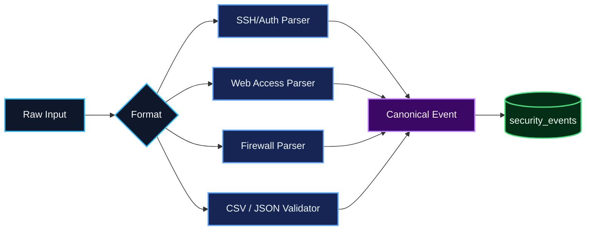

# Ingestion and Normalization

v0.2 accepts canonical structured events and three initial log families.

## Pipeline

## Parser contract

Every parser implements `LogParser.parse_line(line)` and returns either:
- a validated `SecurityEventCreate`, or
- `None` when the line is unsupported/malformed.

The dispatcher tries supported parsers in a deterministic order. Parser failures do not include the raw line in user-facing error messages.

## Linux SSH/Auth

Supported initial patterns:
- `Failed password for <user> from <ip>`
- `Failed password for invalid user <user> from <ip>`
- `Accepted <method> for <user> from <ip>`

Syslog timestamps use the configured/runtime year because traditional auth.log lines omit the year.

## Apache/Nginx

The initial web parser supports common/combined-style access records where the request starts with:

`IP - - [timestamp] "METHOD PATH HTTP/x.x" STATUS SIZE`

The same normalized parser works for Apache and Nginx when they emit this compatible layout.

## Generic firewall format

The initial documented format is whitespace-separated `KEY=VALUE` data:

`TIMESTAMP=... SRC=... DST=... SPT=... DPT=... PROTO=... ACTION=...`

Required keys:
- `TIMESTAMP`
- `SRC`
- `DST`

Unknown extra keys are ignored.

## Batch API

`POST /api/v1/ingest/batch`

Supported format values:
- `json`
- `csv`
- `log`
- `txt`

Limits are configurable using:
- `MAX_BATCH_ROWS`
- `MAX_BATCH_CONTENT_CHARS`

Partial parsing errors return line/row context without echoing sensitive input content.

## Duplicate strategy

v0.2 deliberately does **not** silently deduplicate raw security events because two identical-looking log records can represent distinct observations. Each accepted row receives its own event ID.

Threat-level duplicate creation is prevented separately using a deterministic SHA-256 fingerprint of the rule, source, time range and supporting event IDs.

Future event-level deduplication, if needed for a specific source, should use source-specific stable identifiers rather than deleting repeated-looking telemetry globally.
