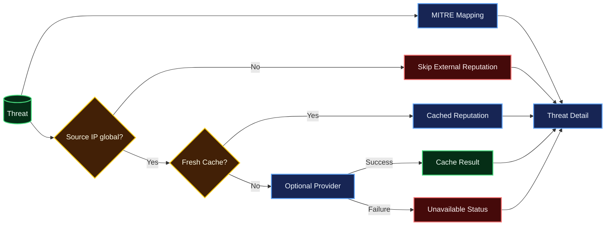

# Threat Intelligence and MITRE ATT&CK

v0.4 enriches deterministic threats without making enrichment a dependency of ingestion or detection.

## Enrichment flow

## MITRE mappings

Mappings are tied to deterministic rule IDs and are absent when evidence is insufficient.

| Detection rule | Technique | Tactic |
|---|---|---|
| `auth.brute_force` | T1110 — Brute Force | Credential Access |
| `auth.brute_force_success` | T1110 — Brute Force | Credential Access |
| `network.port_scan` | T1046 — Network Service Discovery | Discovery |

`web.request_burst` intentionally has no ATT&CK mapping in v0.4 because request volume alone is not enough to assert a specific technique.

## IP reputation

The default provider is `disabled`. External lookups are optional.

Controls:
- Non-global/private/local addresses never trigger external lookups.
- Provider timeouts/errors return `unavailable`; they do not interrupt ingestion.
- Successful results are cached.
- Cache TTL is configurable.
- Provider credentials remain environment configuration.
- Raw provider responses are not persisted; only validated verdict/score/details are stored.

## Threat exploration

Available APIs:
- Threat list with severity, source-IP, rule, free-text and date filters
- Pagination with `limit` and `offset`
- Chronological evidence timeline
- Source-IP aggregate statistics
- MITRE mappings attached to threat-list items

Timeline timestamps are returned as UTC-aware values.
