# Threat Model

AI Security Analyst processes attacker-controlled telemetry and may call external AI or reputation providers. The security model assumes **all incoming log content and all external-provider output are untrusted**.

## Trust boundaries

```mermaid
flowchart LR
    A["Untrusted Log Sources<br/>SSH • Web • Firewall • CSV/JSON"] --> B["API Boundary"]
    B --> C["Validation + Size Limits"]
    C --> D["Normalization"]
    D --> E["Deterministic Detection"]
    E --> F["Risk Scoring"]
    F --> G[(PostgreSQL)]
    F --> H["AI / Reputation Adapter"]
    H --> I["External Provider"]
    H --> G
    G --> J["Analyst API"]
    J --> K["Authenticated Analyst / Admin"]

    classDef untrusted fill:#450a0a,stroke:#f87171,color:#fef2f2,stroke-width:2px;
    classDef boundary fill:#422006,stroke:#facc15,color:#fefce8,stroke-width:2px;
    classDef processing fill:#172554,stroke:#60a5fa,color:#eff6ff,stroke-width:2px;
    classDef data fill:#052e16,stroke:#4ade80,color:#f0fdf4,stroke-width:2px;
    classDef external fill:#3b0764,stroke:#c084fc,color:#faf5ff,stroke-width:2px;

    class A,I untrusted;
    class B,C,J boundary;
    class D,E,F processing;
    class G data;
    class H,K external;
```

## Assets

- Security events and threat evidence
- Threat scores, cases, analyst reviews and enrichment data
- Database credentials
- Analyst/admin API keys
- AI/reputation provider credentials
- Audit metadata
- Detection rules and configuration

## Attacker-controlled inputs

- Event payload fields
- Uploaded/batch log content
- Source/destination network identifiers
- Usernames and HTTP paths appearing in logs
- External provider responses
- AI-generated analysis
- Request headers and request volume

## Primary abuse cases

### Malformed or oversized ingestion

**Risk:** parser crashes, resource exhaustion, oversized requests.

**Mitigations:**
- schema validation;
- request-size limits;
- batch row/content limits;
- bounded analytics ranges;
- rate limiting;
- safe parsing failures.

### Prompt injection in logs

**Risk:** attacker-controlled log text attempts to instruct the AI layer.

**Mitigations:**
- log content is explicitly treated as untrusted data;
- deterministic detection remains authoritative;
- AI output is validated against a structured schema;
- AI failure cannot delete or replace threat evidence;
- provider secrets are not included in evidence prompts unless required by transport.

### Unauthorized analyst actions

**Risk:** unauthenticated users read or mutate security data.

**Mitigations:**
- API-key authentication when enabled;
- explicit `analyst` and `admin` roles;
- production refuses to start with authentication disabled;
- administrative rebuild/correlation operations require `admin`.

### Credential leakage

**Risk:** repository, logs or responses expose secrets.

**Mitigations:**
- secrets are loaded from environment variables;
- example environment file contains placeholders/blank keys;
- request audit logs exclude request bodies and API keys;
- secret scanning is part of repository hardening.

### Resource exhaustion

**Risk:** repeated requests or large datasets exhaust CPU/memory/database resources.

**Mitigations:**
- request-body limits;
- configurable rate limit;
- bounded batch size;
- bounded analytics lookbacks;
- bounded correlation query limit;
- performance smoke tests and benchmark.

### Evidence tampering by automation

**Risk:** AI or review workflows silently rewrite original evidence.

**Mitigations:**
- AI analysis is stored separately;
- analyst reviews are append-only records;
- original deterministic risk/evidence remains unchanged;
- correlated cases reference original threat/event IDs.

## Authentication and authorization

Roles:

| Role | Intended capability |
|---|---|
| Analyst | Read/investigate threats, ingest events, create reviews, request analysis |
| Admin | All analyst capabilities plus administrative rebuild/correlation operations |

Authentication is disabled by default for local development. In `production`, startup validation requires authentication to be enabled and both role keys to be configured.

## Residual risks

- In-memory rate limiting is per process; a production deployment with multiple replicas should enforce an additional shared rate limit at the gateway/load balancer.
- API keys are intentionally simple for this portfolio release; production SSO/OIDC would provide stronger lifecycle and identity management.
- Third-party AI/reputation services have their own privacy and availability risks.
- Detection logic can still produce false positives; analyst review is retained separately for auditability.
